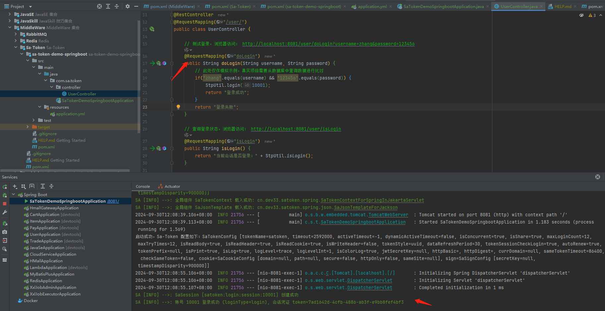
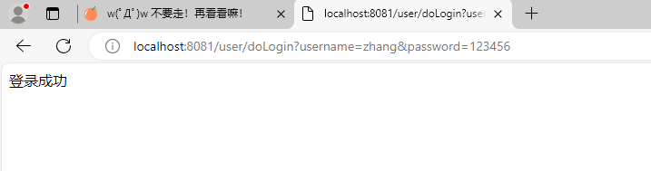
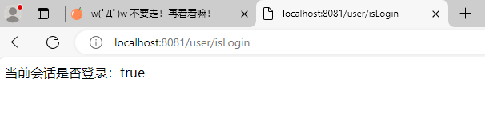

# Sa-Token 介绍

Sa-Token 是一个轻量级 Java 权限认证框架，主要解决：**登录认证**、**权限认证**、**单点登录**、**OAuth2.0**、**分布式 Session 会话**、**微服务网关鉴权**等一系列权限相关问题。


Sa-Token 旨在以简单、优雅的方式完成系统的权限认证部分，以登录认证为例，你只需要：

```java
// 会话登录，参数填登录人的账号id 
StpUtil.login(10001);
```


无需实现任何接口，无需创建任何配置文件，只需要这一句静态代码的调用，便可以完成会话登录认证。

如果一个接口需要登陆后才能访问，我们只需要调用以下代码：

```java
// 校验当前客户端是否已经登录，如果未登录则抛出 `NotLoginException` 异常
StpUtil.checkLogin();
```

在 Sa-Token 中，大多数功能都可以一行代码解决：

踢人下线：

```java
// 将账号id为 10077 的会话踢下线 
StpUtil.kickout(10077);
```

权限认证：

```java
// 注解鉴权：只有具备 `user:add` 权限的会话才可以进入方法
@SaCheckPermission("user:add")
public String insert(SysUser user) {
    // ... 
    return "用户增加";
}
```

路由拦截鉴权：

```java
// 根据路由划分模块，不同模块不同鉴权 
registry.addInterceptor(new SaInterceptor(handler -> {
    SaRouter.match("/user/**", r -> StpUtil.checkPermission("user"));
    SaRouter.match("/admin/**", r -> StpUtil.checkPermission("admin"));
    SaRouter.match("/goods/**", r -> StpUtil.checkPermission("goods"));
    SaRouter.match("/orders/**", r -> StpUtil.checkPermission("orders"));
    SaRouter.match("/notice/**", r -> StpUtil.checkPermission("notice"));
    // 更多模块... 
})).addPathPatterns("/**");
```

当你受够了 Shiro、SpringSecurity 等框架的三拜九叩之后，你就会明白，相对于这些传统老牌框架，Sa-Token 的 API 设计是多么的简单、优雅！


## Sa-Token 功能预览

Sa-Token 目前主要五大功能模块：登录认证、权限认证、单点登录、OAuth2.0、微服务鉴权。

- **登录认证** —— 单端登录、多端登录、同端互斥登录、七天免登录。
- **权限认证** —— 权限认证、角色认证、会话二级认证。
- **踢人下线** —— 根据账号 id 踢人下线、根据 Token 值踢人下线。
- **注解式鉴权** —— 优雅的将鉴权与业务代码分离。
- **路由拦截式鉴权** —— 根据项目路由拦截鉴权，可适配 restful 模式。
- **Session 会话** —— 全端共享 Session ，单端独享 Session，自定义 Session ，方便的存取值。
- **持久层扩展** —— 可集成 Redis ，重启数据不丢失。
- **前后台分离** —— APP 、小程序等不支持 Cookie 的终端也可以轻松鉴权。
- **Token 风格定制** —— 内置流中 Token 风格，还可：自定义 Token 生成策略。
- **记住我模式** —— 适配 [记住我] 模式，重启浏览器免验证。
- **二级认证** —— 在已登录的基础上再次认证，保证安全性。
- **模拟他人账号** —— 实时操作任意用户状态数据。
- **临时身份切换** —— 将会话身份临时切换为其他账号。
- **同端互斥登录** —— 像 QQ 一样手机电脑同时在线，但是两个手机上互斥登录。
- **账号封禁** —— 登录封禁、按照业务分类封禁、按照处罚阶梯封禁。
- **密码加密** —— 提供基础加密算法，可快速 MD5、SHA1、SHA256、AES 加密。
- **会话查询** —— 提供方便灵活的会话查询接口。
- **Http Basic 认证** —— 一行代码接入 Http Basic 、Digest 认证。
- **全局侦听器** —— 在用户登录、注销、被踢下线等关键性操作时进行一些 AOP 操作。
- **全局过滤器** —— 方便的处理跨域，全局设置安全响应头等操作。
- **多账号体系认证** —— 一个系统多套账号分开鉴权（比如商城的 User 表和 Admin 表）。
- **单点登录** —— 内置三种单点登录模式：同城、跨域、同 Redis、跨 Redis、前后端分离等架构都可以搞定。
- **单点注销** —— 任意子系统内发起注销，即可全端下线。
- **OAuth2.0 认证** —— 轻松搭建 OAuth2.0 服务，支持 openid 模式。
- **分布式会话** —— 提供共享数据中心分布式会话方案。
- **微服务网关鉴权** —— 适配 Gateway 、ShenYu 、Zuul 等常见网关的路由拦截认证。
- **RPC 调用鉴权** —— 网关转发鉴权，RPC 调用鉴权，让服务调用不再裸奔。
- **临时 Token 认证** —— 解决短时间的 Token 授权问题。
- **独立 Redis** —— 将权限缓存与业务缓存分离。
- **Quick 快速登录认证** —— 为项目零代码注入一个登录页面。
- **标签方言** —— 提供 Thymeleaf 标签方言集成包，提供 beetl 集成示例。
- **jwt 集成** —— 提供三种模式的 jwt 集成方案，提供 token 扩展参数能力。
- **RPC 调用状态传递** —— 提供 dubbo 、grpc 等集成包，在 RPC 调用时登陆状态不丢失。
- **参数签名** —— 提供跨系统 API 调用签名校验模块，防止参数篡改，防止请求重放。
- **自动续签** —— 提供两种 Token 过期策略，灵活搭配使用，还可以自动续签。
- **开箱即用** —— 提供 SpringMVC 、WebFlus 、Solon 等常见框架集成包，开箱即用。
- **最新技术栈** —— 适配最新技术栈：支持 SpringBoot 3.x ，jdk 17 。

功能结构图：


------


# 在 SpringBoot 中集成


## 1、创建项目

在 IDE 中新建一个 SpringBoot 项目，例如 `sa-token-demo-springboot`


## 2、添加依赖

在项目中添加依赖：

Maven 方式

注：如果你使用的是 SpringBoot 3.x，只需要将 `sa-token-spring-boot-starter` 修改为 `sa-token-spring-boot3-starter` 即可。

```xml
<!-- Sa-Token 权限认证，在线文档：https://sa-token.cc -->
<dependency>
    <groupId>cn.dev33</groupId>
    <artifactId>sa-token-spring-boot-starter</artifactId>
    <version>1.39.0</version>
</dependency>
```


## 3、设置配置文件

你可以**零配置启动项目** ，但同时你也可以在 `application.yml` 中增加如下配置，定制性使用框架：

```yaml
server:
    # 端口
    port: 8081
    
############## Sa-Token 配置 (文档: https://sa-token.cc) ##############
sa-token: 
    # token 名称（同时也是 cookie 名称）
    token-name: satoken
    # token 有效期（单位：秒） 默认30天，-1 代表永久有效
    timeout: 2592000
    # token 最低活跃频率（单位：秒），如果 token 超过此时间没有访问系统就会被冻结，默认-1 代表不限制，永不冻结
    active-timeout: -1
    # 是否允许同一账号多地同时登录 （为 true 时允许一起登录, 为 false 时新登录挤掉旧登录）
    is-concurrent: true
    # 在多人登录同一账号时，是否共用一个 token （为 true 时所有登录共用一个 token, 为 false 时每次登录新建一个 token）
    is-share: true
    # token 风格（默认可取值：uuid、simple-uuid、random-32、random-64、random-128、tik）
    token-style: uuid
    # 是否输出操作日志 
    is-log: true
```


## 4、创建启动类

在项目中新建包 `com.sa.token` ，在此包内新建主类 `SaTokenDemoApplication.java`，复制以下代码：

```java
@SpringBootApplication
public class SaTokenDemoApplication {
    public static void main(String[] args) throws JsonProcessingException {
        SpringApplication.run(SaTokenDemoApplication.class, args);
        System.out.println("启动成功，Sa-Token 配置如下：" + SaManager.getConfig());
    }
}
```


## 5、创建测试 Controller

```java
@RestController
@RequestMapping("/user/")
public class UserController {

    // 测试登录，浏览器访问： http://localhost:8081/user/doLogin?username=zhang&password=123456
    @RequestMapping("doLogin")
    public String doLogin(String username, String password) {
        // 此处仅作模拟示例，真实项目需要从数据库中查询数据进行比对 
        if("zhang".equals(username) && "123456".equals(password)) {
            StpUtil.login(10001);
            return "登录成功";
        }
        return "登录失败";
    }

    // 查询登录状态，浏览器访问： http://localhost:8081/user/isLogin
    @RequestMapping("isLogin")
    public String isLogin() {
        return "当前会话是否登录：" + StpUtil.isLogin();
    }
    
}
```


## 6、运行

启动代码，依次运行上述接口：








------


# 登录认证


## 1、设计思路

对于一些登录之后才能访问的接口（例如：查询我的账号资料），我们通常的做法是增加一层接口校验：

- 如果校验通过，则：正常返回数据
- 如果校验未通过，则：抛出异常，告知其需要先进性登录。

那么，判断会话是否登录的依据是什么？我们先来简单分析一下登录访问流程：

1. 用户提交 `name` + `password` 参数，调用登录接口。
2. 登录成功，返回这个用户的 Token 会话凭证。
3. 用户后续的每次请求，都携带上这个 Token。
4. 服务器根据 Token 判断此会话是否登录成功。

所谓登录认证，指的就是服务器校验账号密码，为用户颁发 Token 会话凭证的过程，这个 Token 也是我们后续判断会话是否登录的关键所在。

<button style="background: #fbca1f; font-family: inherit; padding: 0.6em 1.3em; font-weight: 900; font-size: 18px;
border: 3px solid black; border-radius: 0.4em; box-shadow: 0.1em 0.1em; cursor: pointer; transition: transform 0.1s, box-shadow 0.1s;"
onclick="window.open('https://oss.dev33.cn/sa-token/doc/g/g3--login-auth.gif', '_blank');"
onmouseover="this.style.transform='translate(-0.05em, -0.05em)'; this.style.boxShadow='0.15em 0.15em';"
onmouseout="this.style.transform=''; this.style.boxShadow='0.1em 0.1em';"
onmousedown="this.style.transform='translate(0.05em, 0.05em)'; this.style.boxShadow='0.05em 0.05em';"
onmouseup="this.style.transform=''; this.style.boxShadow='0.1em 0.1em';">
加载动态演示图
</button>


## 2、登录与注销

根据以上思路，我们需要一个会话登录的函数：

```java
// 会话登录：参数填写要登录的账号id，建议的数据类型：long | int | String， 不可以传入复杂类型，如：User、Admin 等等
StpUtil.login(Object id);     
```

只此一句代码，便可以使会话登录成功，实际上，Sa-Token 在背后做了大量的工作，包括但不限于：

1. 检查此账号是否之前已有登录；
2. 为账号生成 `Token` 凭证与 `Session` 会话；
3. 记录 Token 活跃时间；
4. 通知全局侦听器，xx 账号登录成功；
5. 将 `Token` 注入到请求上下问；

你暂时不需要完整了解整个登录过程，你只需要记住关键一点：`Sa-Token 为这个账号创建了一个Token凭证，且通过 Cookie 上下文返回给了前端`。

所以一般情况下，我们的登录接口代码，会大致类似如下：

```java
// 会话登录接口 
@RequestMapping("doLogin")
public SaResult doLogin(String name, String pwd) {
    // 第一步：比对前端提交的账号名称、密码
    if("zhang".equals(name) && "123456".equals(pwd)) {
        // 第二步：根据账号id，进行登录 
        StpUtil.login(10001);
        return SaResult.ok("登录成功");
    }
    return SaResult.error("登录失败");
}
```

如果你对以上代码阅读没有压力，你可能会注意到略显奇怪的一点：此处仅仅做了会话登录，但并没有主动向前端返回 token 信息。是因为不需要吗？严格来讲是需要的，只不过 `StpUtil.login(id)` 方法利用了 Cookie 自动注入的特性，省略了你手写返回 token 的代码。

> 
> Cookie 是什么？
>
> 如果你对 Cookie 功能还不太了解，也不用担心，我们会在之后的 [ 前后端分离 ] 章节中详细的阐述 Cookie 功能，现在你只需要了解最基本的两点：
>
> - Cookie 可以从后端控制往浏览器中写入 token 值。
> - Cookie 会在前端每次发起请求时自动提交 token 值。
>
> 因此，在 Cookie 功能的加持下，我们可以仅靠 `StpUtil.login(id)` 一句代码就完成登录认证。

除了登录方法，我们还需要：

```java
// 当前会话注销登录
StpUtil.logout();

// 获取当前会话是否已经登录，返回true=已登录，false=未登录
StpUtil.isLogin();

// 检验当前会话是否已经登录, 如果未登录，则抛出异常：`NotLoginException`
StpUtil.checkLogin();
```

异常 `NotLoginException` 代表当前会话暂未登录，可能的原因有很多：前端没有提交 token 、前端提交的 token 是无效的、前端提交的 token 已经过期 ...... 等等，可参照：[未登录场景值](https://sa-token.cc/doc.html#/fun/not-login-scene) 了解如何获取未登录的场景值。


## 3、会话查询

```java
// 获取当前会话账号id, 如果未登录，则抛出异常：`NotLoginException`
StpUtil.getLoginId();

// 类似查询API还有：
StpUtil.getLoginIdAsString();    // 获取当前会话账号id, 并转化为`String`类型
StpUtil.getLoginIdAsInt();       // 获取当前会话账号id, 并转化为`int`类型
StpUtil.getLoginIdAsLong();      // 获取当前会话账号id, 并转化为`long`类型

// ---------- 指定未登录情形下返回的默认值 ----------

// 获取当前会话账号id, 如果未登录，则返回 null 
StpUtil.getLoginIdDefaultNull();

// 获取当前会话账号id, 如果未登录，则返回默认值 （`defaultValue`可以为任意类型）
StpUtil.getLoginId(T defaultValue);
```


## 4、Token 查询

```java
// 获取当前会话的 token 值
StpUtil.getTokenValue();

// 获取当前`StpLogic`的 token 名称
StpUtil.getTokenName();

// 获取指定 token 对应的账号id，如果未登录，则返回 null
StpUtil.getLoginIdByToken(String tokenValue);

// 获取当前会话剩余有效期（单位：s，返回-1代表永久有效）
StpUtil.getTokenTimeout();

// 获取当前会话的 token 信息参数
StpUtil.getTokenInfo();
```

有关`TokenInfo`参数详解，请参考：[TokenInfo参数详解](https://sa-token.cc/doc.html#/fun/token-info)


##  5、来个小测试，加深一下理解

```java
/**
 * 登录测试 
 */
@RestController
@RequestMapping("/acc/")
public class LoginController {

    // 测试登录  ---- http://localhost:8081/acc/doLogin?name=zhang&pwd=123456
    @RequestMapping("doLogin")
    public SaResult doLogin(String name, String pwd) {
        // 此处仅作模拟示例，真实项目需要从数据库中查询数据进行比对 
        if("zhang".equals(name) && "123456".equals(pwd)) {
            StpUtil.login(10001);
            return SaResult.ok("登录成功");
        }
        return SaResult.error("登录失败");
    }

    // 查询登录状态  ---- http://localhost:8081/acc/isLogin
    @RequestMapping("isLogin")
    public SaResult isLogin() {
        return SaResult.ok("是否登录：" + StpUtil.isLogin());
    }
    
    // 查询 Token 信息  ---- http://localhost:8081/acc/tokenInfo
    @RequestMapping("tokenInfo")
    public SaResult tokenInfo() {
        return SaResult.data(StpUtil.getTokenInfo());
    }
    
    // 测试注销  ---- http://localhost:8081/acc/logout
    @RequestMapping("logout")
    public SaResult logout() {
        StpUtil.logout();
        return SaResult.ok();
    }
    
}
```

[本章代码示例：Sa-Token 登录认证 —— [ LoginAuthController.java \]](https://gitee.com/dromara/sa-token/blob/master/sa-token-demo/sa-token-demo-case/src/main/java/com/pj/cases/use/LoginAuthController.java)


------


# 权限认证


## 1、设计思路

所谓权限认证，核心逻辑就是判断一个账号是否拥有指定权限：

- 有，就让你通过。
- 没有？那么禁止访问！

深入到底层数据中，就是每个账号都会拥有一组权限码集合，框架来校验这个集合中是否包含指定的权限码。

例如：当前账号哦拥有权限码集合 `["user-add", "user-delete", "user-get"]` ，这时候我来校验权限 `"user-update"` ，则其结果就是：验证失败，禁止访问。

<button style="background: #fbca1f; font-family: inherit; padding: 0.6em 1.3em; font-weight: 900; font-size: 18px; border: 3px solid black; border-radius: 0.4em; box-shadow: 0.1em 0.1em; cursor: pointer; transition: transform 0.1s, box-shadow 0.1s;" onclick="toggleGif()" onmouseover="this.style.transform='translate(-0.05em, -0.05em)'; this.style.boxShadow='0.15em 0.15em';" onmouseout="this.style.transform=''; this.style.boxShadow='0.1em 0.1em';" onmousedown="this.style.transform='translate(0.05em, 0.05em)'; this.style.boxShadow='0.05em 0.05em';" onmouseup="this.style.transform=''; this.style.boxShadow='0.1em 0.1em';">
加载动态演示图
</button>


<script>
function toggleGif() {
    const gif = document.getElementById('gifImage');
    if (gif.style.display === 'none' || gif.style.display === '') {
        gif.style.display = 'block'; 
    } else {
        gif.style.display = 'none'; 
    }
}
</script>

<br><br>

所以现在问题的核心就是两个：

1. 如何获取一个账号所拥有的权限码集合？
2. 本次操作需要验证的权限码是哪个？


## 2、获取当前账号权限码集合

因为每个项目的需求不同，其权限设计也千变万化，因此 [ 获取当前账号权限码集合 ] 这一操作不可能内置到框架中，所以 Sa-Token 将此操作以接口的方式暴露给你，以方便你根据自己的业务逻辑进行重写。

你需要做的是新建一个类，实现 `StpInterface` 接口，例如以下代码：

```java
/**
 * 自定义权限加载接口实现类
 */
@Component    // 保证此类被 SpringBoot 扫描，完成 Sa-Token 的自定义权限验证扩展 
public class StpInterfaceImpl implements StpInterface {

    /**
     * 返回一个账号所拥有的权限码集合 
     */
    @Override
    public List<String> getPermissionList(Object loginId, String loginType) {
        // 本 list 仅做模拟，实际项目中要根据具体业务逻辑来查询权限
        List<String> list = new ArrayList<String>();    
        list.add("101");
        list.add("user.add");
        list.add("user.update");
        list.add("user.get");
        // list.add("user.delete");
        list.add("art.*");
        return list;
    }

    /**
     * 返回一个账号所拥有的角色标识集合 (权限与角色可分开校验)
     */
    @Override
    public List<String> getRoleList(Object loginId, String loginType) {
        // 本 list 仅做模拟，实际项目中要根据具体业务逻辑来查询角色
        List<String> list = new ArrayList<String>();    
        list.add("admin");
        list.add("super-admin");
        return list;
    }

}
```

**参数解释：**

- loginId：账号 id，即你在调用 `StpUtil.login(id)` 时写入的标识值。
- loginType：账号体系标识，此处可以暂时忽略，在 [ 多账户认证 ] 章节下会对这个概念做详细的解释。

> 有同学会产生疑问：我实现了此接口，但是程序启动时好像并没有执行，是不是我写错了？
>
> 答：不执行是正常现象，程序启动时不会执行这个接口的方法，在每次调用鉴权代码时，才会执行到此。


## 3、权限校验

然后就可以用以下 api 来鉴权了

```java
// 获取：当前账号所拥有的权限集合
StpUtil.getPermissionList();

// 判断：当前账号是否含有指定权限, 返回 true 或 false
StpUtil.hasPermission("user.add");        

// 校验：当前账号是否含有指定权限, 如果验证未通过，则抛出异常: NotPermissionException 
StpUtil.checkPermission("user.add");        

// 校验：当前账号是否含有指定权限 [指定多个，必须全部验证通过]
StpUtil.checkPermissionAnd("user.add", "user.delete", "user.get");        

// 校验：当前账号是否含有指定权限 [指定多个，只要其一验证通过即可]
StpUtil.checkPermissionOr("user.add", "user.delete", "user.get");    
```

扩展：`NotPermissionException` 对象可通过 `getLoginType()` 方法获取具体是哪个 `StpLogic` 抛出的异常


## 4、角色校验

在 Sa-Token 中，角色和权限可以分开独立验证

```java
// 获取：当前账号所拥有的角色集合
StpUtil.getRoleList();

// 判断：当前账号是否拥有指定角色, 返回 true 或 false
StpUtil.hasRole("super-admin");        

// 校验：当前账号是否含有指定角色标识, 如果验证未通过，则抛出异常: NotRoleException
StpUtil.checkRole("super-admin");        

// 校验：当前账号是否含有指定角色标识 [指定多个，必须全部验证通过]
StpUtil.checkRoleAnd("super-admin", "shop-admin");        

// 校验：当前账号是否含有指定角色标识 [指定多个，只要其一验证通过即可] 
StpUtil.checkRoleOr("super-admin", "shop-admin");        
```

扩展：`NotRoleException` 对象可通过 `getLoginType()` 方法获取具体是哪个 `StpLogic` 抛出的异常


## 5、拦截全局异常

有同学要问，鉴权失败，抛出异常，然后呢？要把异常显示给用户看吗？**当然不可以！**

你可以创建一个全局异常拦截器，统一返回给前端的格式，参考：

```java
@RestControllerAdvice
public class GlobalExceptionHandler {
    // 全局异常拦截 
    @ExceptionHandler
    public SaResult handlerException(Exception e) {
        e.printStackTrace(); 
        return SaResult.error(e.getMessage());
    }
}
```

可参考：[码云：GlobalException.java](https://gitee.com/dromara/sa-token/blob/master/sa-token-demo/sa-token-demo-case/src/main/java/com/pj/current/GlobalException.java)


## 6、权限通配符

Sa-Token允许你根据通配符指定**泛权限**，例如当一个账号拥有`art.*`的权限时，`art.add`、`art.delete`、`art.update`都将匹配通过

```java
// 当拥有 art.* 权限时
StpUtil.hasPermission("art.add");        // true
StpUtil.hasPermission("art.update");     // true
StpUtil.hasPermission("goods.add");      // false

// 当拥有 *.delete 权限时
StpUtil.hasPermission("art.delete");      // true
StpUtil.hasPermission("user.delete");     // true
StpUtil.hasPermission("user.update");     // false

// 当拥有 *.js 权限时
StpUtil.hasPermission("index.js");        // true
StpUtil.hasPermission("index.css");       // false
StpUtil.hasPermission("index.html");      // false
```

> 上帝权限
>
> 当一个账号拥有 `"*"` 权限时，他可以验证通过任何权限码 （角色认证同理）


## 7、如何把权限精确到按钮级？

权限精确到按钮级的意思就是指：**权限范围可以控制到页面上的每一个按钮是否显示** 。

思路：如此精确的范围控制只依赖后端已经难以完成，此时需要前端进行一定的逻辑判断。

如果是前后端一体项目，可以参考：[Thymeleaf 标签方言](https://sa-token.cc/doc.html#/plugin/thymeleaf-extend)，如果是前后端分离项目，则：

1. 在登录时，把当前账号拥有的所有权限码一次性返回给前端。

2. 前端将权限码集合保存在 `localStorage` 或其他全局状态管理对象中。

3. 在需要权限控制的按钮上，使用 js 进行逻辑判断，例如在 `Vue` 框架中我们可以使用如下写法：

   ```js
   // `arr`是当前用户拥有的权限码数组
   // `user.delete`是显示按钮需要拥有的权限码
   // `删除按钮`是用户拥有权限码才可以看到的内容。
   <button v-if="arr.indexOf('user.delete') > -1">删除按钮</button>
   ```

以上写法只为提供一个参考示例，不同框架有不同写法，大家可根据项目技术栈灵活封装进行调用。

>
> ✍ 前端有了鉴权后端还需要鉴权吗？
>
> **需要！**
> 前端的鉴权只是一个辅助功能，对于专业人员这些限制都是可以轻松绕过的，为保证服务器安全：**无论前端是否进行了权限校验，后端接口都需要对会话请求再次进行权限校验！**


## 8、示例代码

```java
/**
 * Sa-Token 权限认证示例 
 * 
 * @author click33
 * @since 2022-10-13
 */
@RestController
@RequestMapping("/jur/")
public class JurAuthController {

	/*
	 * 前提1：首先调用登录接口进行登录，代码在 com.pj.cases.use.LoginAuthController 中有详细解释，此处不再赘述 
	 * 		---- http://localhost:8081/acc/doLogin?name=zhang&pwd=123456
	 * 
	 * 前提2：项目实现 StpInterface 接口，代码在  com.pj.satoken.StpInterfaceImpl
	 * 		Sa-Token 将从此实现类获取 每个账号拥有哪些权限。
	 * 
	 * 然后我们就可以使用以下示例中的代码进行鉴权了 
	 */
	
	// 查询权限   ---- http://localhost:8081/jur/getPermission
	@RequestMapping("getPermission")
	public SaResult getPermission() {
		// 查询权限信息 ，如果当前会话未登录，会返回一个空集合 
		List<String> permissionList = StpUtil.getPermissionList();
		System.out.println("当前登录账号拥有的所有权限：" + permissionList);
		
		// 查询角色信息 ，如果当前会话未登录，会返回一个空集合 
		List<String> roleList = StpUtil.getRoleList();
		System.out.println("当前登录账号拥有的所有角色：" + roleList);
		
		// 返回给前端 
		return SaResult.ok()
				.set("roleList", roleList)
				.set("permissionList", permissionList);
	}
	
	// 权限校验  ---- http://localhost:8081/jur/checkPermission
	@RequestMapping("checkPermission")
	public SaResult checkPermission() {
		
		// 判断：当前账号是否拥有一个权限，返回 true 或 false
		// 		如果当前账号未登录，则永远返回 false 
		StpUtil.hasPermission("user.add");
		StpUtil.hasPermissionAnd("user.add", "user.delete", "user.get");  // 指定多个，必须全部拥有才会返回 true 
		StpUtil.hasPermissionOr("user.add", "user.delete", "user.get");	 // 指定多个，只要拥有一个就会返回 true 
		
		// 校验：当前账号是否拥有一个权限，校验不通过时会抛出 `NotPermissionException` 异常 
		// 		如果当前账号未登录，则永远校验失败 
		StpUtil.checkPermission("user.add");
		StpUtil.checkPermissionAnd("user.add", "user.delete", "user.get");  // 指定多个，必须全部拥有才会校验通过 
		StpUtil.checkPermissionOr("user.add", "user.delete", "user.get");  // 指定多个，只要拥有一个就会校验通过 
		
		return SaResult.ok();
	}

	// 角色校验  ---- http://localhost:8081/jur/checkRole
	@RequestMapping("checkRole")
	public SaResult checkRole() {
		
		// 判断：当前账号是否拥有一个角色，返回 true 或 false
		// 		如果当前账号未登录，则永远返回 false 
		StpUtil.hasRole("admin");
		StpUtil.hasRoleAnd("admin", "ceo", "cfo");  // 指定多个，必须全部拥有才会返回 true 
		StpUtil.hasRoleOr("admin", "ceo", "cfo");	  // 指定多个，只要拥有一个就会返回 true 
		
		// 校验：当前账号是否拥有一个角色，校验不通过时会抛出 `NotRoleException` 异常 
		// 		如果当前账号未登录，则永远校验失败 
		StpUtil.checkRole("admin");
		StpUtil.checkRoleAnd("admin", "ceo", "cfo");  // 指定多个，必须全部拥有才会校验通过 
		StpUtil.checkRoleOr("admin", "ceo", "cfo");  // 指定多个，只要拥有一个就会校验通过 
		
		return SaResult.ok();
	}

	// 权限通配符  ---- http://localhost:8081/jur/wildcardPermission
	@RequestMapping("wildcardPermission")
	public SaResult wildcardPermission() {
		
		// 前提条件：在 StpInterface 实现类中，为账号返回了 "art.*" 泛权限
		StpUtil.hasPermission("art.add");  // 返回 true 
		StpUtil.hasPermission("art.delete");  // 返回 true 
		StpUtil.hasPermission("goods.add");  // 返回 false，因为前缀不符合  
		
		// * 符合可以出现在任意位置，比如权限码的开头，当账号拥有 "*.delete" 时  
		StpUtil.hasPermission("goods.add");        // false
		StpUtil.hasPermission("goods.delete");     // true
		StpUtil.hasPermission("art.delete");      // true
		
		// 也可以出现在权限码的中间，比如当账号拥有 "shop.*.user" 时  
		StpUtil.hasPermission("shop.add.user");  // true
		StpUtil.hasPermission("shop.delete.user");  // true
		StpUtil.hasPermission("shop.delete.goods");  // false，因为后缀不符合 

		// 注意点：
		// 1、上帝权限：当一个账号拥有 "*" 权限时，他可以验证通过任何权限码
		// 2、角色校验也可以加 * ，指定泛角色，例如： "*.admin"，暂不赘述 
		
		return SaResult.ok();
	}

}
```

[本章代码示例：Sa-Token 权限认证 —— [ JurAuthController.java \]](https://gitee.com/dromara/sa-token/blob/master/sa-token-demo/sa-token-demo-case/src/main/java/com/pj/cases/use/JurAuthController.java)


------


# 踢人下线

所谓踢人下线，核心操作就是找到指定 `loginId` 对应的 `Token` ，并设置其失效。


## 1、强制注销

```java
StpUtil.logout(10001);                    // 强制指定账号注销下线 
StpUtil.logout(10001, "PC");              // 强制指定账号指定端注销下线 
StpUtil.logoutByTokenValue("token");      // 强制指定 Token 注销下线 
```


## 2、踢人下线

```java
StpUtil.kickout(10001);                    // 将指定账号踢下线 
StpUtil.kickout(10001, "PC");              // 将指定账号指定端踢下线
StpUtil.kickoutByTokenValue("token");      // 将指定 Token 踢下线
```


强制注销 和 踢人下线 的区别在于：

- 强制注销等价于对方主动调用了注销方法，再次访问会提示：Token无效。
- 踢人下线不会清除Token信息，而是将其打上特定标记，再次访问会提示：Token已被踢下线。


<button style="background: #fbca1f; font-family: inherit; padding: 0.6em 1.3em; font-weight: 900; font-size: 18px; border: 3px solid black; border-radius: 0.4em; box-shadow: 0.1em 0.1em; cursor: pointer; transition: transform 0.1s, box-shadow 0.1s;" 
      onclick="toggleGif1()" onmouseover="this.style.transform='translate(-0.05em, -0.05em)'; this.style.boxShadow='0.15em 0.15em';" onmouseout="this.style.transform=''; this.style.boxShadow='0.1em 0.1em';" onmousedown="this.style.transform='translate(0.05em, 0.05em)'; this.style.boxShadow='0.05em 0.05em';" onmouseup="this.style.transform=''; this.style.boxShadow='0.1em 0.1em';">
加载动态演示图
</button>


<script>
function toggleGif1() {
    const gif = document.getElementById('gifImage1');
    if (gif.style.display === 'none' || gif.style.display === '') {
        gif.style.display = 'block'; 
    } else {
        gif.style.display = 'none'; 
    }
}
</script>

<br><br>

[本章代码示例：Sa-Token 踢人下线 —— [ KickoutController.java \]](https://gitee.com/dromara/sa-token/blob/master/sa-token-demo/sa-token-demo-case/src/main/java/com/pj/cases/use/KickoutController.java)


------


# 注解鉴权


## 注解鉴权

有同学表示：尽管使用代码鉴权非常方便，但是我们仍希望把鉴权逻辑和业务逻辑分离出来，我们可以使用注解鉴权吗？当然可以！

注解鉴权 —— 优雅的将鉴权与业务代码分离！

- `@SaCheckLogin`：登录校验 —— 只有登录之后才能够进入该方法。
- `@SaCheckRole("admin")`：角色校验 —— 必须具有指定角色标识才能进入该方法。
- `@SaCheckPermission("user:add")`：权限校验 —— 必须具有指定权限才能进入该方法。
- `@SacheckSafe`：二级认证校验 —— 必须二级认证之后才能进入该方法。
- `@SaCheckHttpBasic`：HttpBasic 校验 —— 只有通过 HttpBasic 认证后才能进入该方法。
- `@SaCheckHttpDigest`：HttpDigest 校验 —— 只有通过 HttpDigest 认证后才能进入该方法。
- `@SaIgnore`：忽略校验 —— 表示被修饰的方法或类无需进行注解鉴权和路由拦截器鉴权。
- `@SacheckDisable("comment")`：账号服务封禁校验 —— 校验当前账号指定服务是否被封禁。

Sa-Token 使用全局拦截器完成注解鉴权功能，为了不为项目带来不必要的性能负担，拦截器默认处于关闭状态

因此，为了使用注解鉴权，**你必须手动将 Sa-Token 的全局拦截器注册到你项目中**


## 1、注册拦截器

以`SpringBoot2.0`为例，新建配置类`SaTokenConfigure.java`

```java
@Configuration
public class SaTokenConfigure implements WebMvcConfigurer {
    // 注册 Sa-Token 拦截器，打开注解式鉴权功能 
    @Override
    public void addInterceptors(InterceptorRegistry registry) {
        // 注册 Sa-Token 拦截器，打开注解式鉴权功能 
        registry.addInterceptor(new SaInterceptor()).addPathPatterns("/**");    
    }
}
```

保证此类被`springboot`启动类扫描到即可


## 2、使用注解鉴权

然后我们就可以愉快的使用注解鉴权了：

```java
// 登录校验：只有登录之后才能进入该方法 
@SaCheckLogin                        
@RequestMapping("info")
public String info() {
    return "查询用户信息";
}

// 角色校验：必须具有指定角色才能进入该方法 
@SaCheckRole("super-admin")        
@RequestMapping("add")
public String add() {
    return "用户增加";
}

// 权限校验：必须具有指定权限才能进入该方法 
@SaCheckPermission("user-add")        
@RequestMapping("add")
public String add() {
    return "用户增加";
}

// 二级认证校验：必须二级认证之后才能进入该方法 
@SaCheckSafe()        
@RequestMapping("add")
public String add() {
    return "用户增加";
}

// Http Basic 校验：只有通过 Http Basic 认证后才能进入该方法 
@SaCheckHttpBasic(account = "sa:123456")
@RequestMapping("add")
public String add() {
    return "用户增加";
}

// Http Digest 校验：只有通过 Http Digest 认证后才能进入该方法 
@SaCheckHttpDigest(value = "sa:123456")
@RequestMapping("add")
public String add() {
    return "用户增加";
}

// 校验当前账号是否被封禁 comment 服务，如果已被封禁会抛出异常，无法进入方法 
@SaCheckDisable("comment")                
@RequestMapping("send")
public String send() {
    return "查询用户信息";
}
```


注：以上注解都可以加在类上，代表为这个类所有方法进行鉴权


## 3、设定校验模式

`@SaCheckRole`与`@SaCheckPermission`注解可设置校验模式，例如：

```java
// 注解式鉴权：只要具有其中一个权限即可通过校验 
@RequestMapping("atJurOr")
@SaCheckPermission(value = {"user-add", "user-all", "user-delete"}, mode = SaMode.OR)        
public SaResult atJurOr() {
    return SaResult.data("用户信息");
}
```

mode 有两种取值：

- `SaMode.AND`，标注一组权限，会话必须全部具有才可通过校验。
- `SaMode.OR`，标注一组权限，会话只要具有其一即可通过校验。


## 4、角色权限双重校验 "or 校验"

假设有以下业务场景：一个接口在具有权限 `user.add` 或角色 `admin` 时可以调通。怎么写？

```java
// 角色权限双重 “or校验”：具备指定权限或者指定角色即可通过校验
@RequestMapping("userAdd")
@SaCheckPermission(value = "user.add", orRole = "admin")        
public SaResult userAdd() {
    return SaResult.data("用户信息");
}
```

orRole 字段代表权限校验未通过时的次要选择，两者只要一校验成功即可进入请求方法，其有三种写法：

- 写法一：`orRole = "admin"`，代表需要拥有角色 admin 。
- 写法二：`orRole = {"admin", "manager", "staff"}`，代表具有三个角色其一即可。
- 写法三：`orRole = {"admin, manager, staff"}`，代表必须同时具有三个角色。


## 5、忽略认证

使用 `@SaIgnore` 可表示一个接口忽略认证：

```java
@SaCheckLogin
@RestController
public class TestController {
    
    // ... 其它方法 
    
    // 此接口加上了 @SaIgnore 可以游客访问 
    @SaIgnore
    @RequestMapping("getList")
    public SaResult getList() {
        // ... 
        return SaResult.ok(); 
    }
}
```

如上代码表示：`TestController` 中的所有方法都需要登录后才可以访问，但是 `getList` 接口可以匿名游客访问。

- `@SaIgnore` 修饰方法时代表这个方法可以被游客访问，修饰类时代表这个类中的所有接口都可以游客访问。
- `@SaIgnore` 具有最高优先级，当 @SaIgnore 和其它鉴权注解一起出现时，其它鉴权注解都将被忽略。
- `@SaIgnore` 同样可以忽略掉 Sa-Token 拦截器中的路由鉴权，在下面的 [路由拦截鉴权] 章节中我们会讲到。


## 6、批量注解鉴权

使用 `@SaCheckOr` 表示批量注解鉴权：

```java
// 在 `@SaCheckOr` 中可以指定多个注解，只要当前会话满足其中一个注解即可通过验证，进入方法。
@SaCheckOr(
        login = @SaCheckLogin,
        role = @SaCheckRole("admin"),
        permission = @SaCheckPermission("user.add"),
        safe = @SaCheckSafe("update-password"),
        httpBasic = @SaCheckHttpBasic(account = "sa:123456"),
        disable = @SaCheckDisable("submit-orders")
)
@RequestMapping("test")
public SaResult test() {
    // ... 
    return SaResult.ok(); 
}
```

每一项属性都可以写成数组形式，例如：

```java
// 当前客户端只要有 [ login 账号登录] 或者 [user 账号登录] 其一，就可以通过验证进入方法。
//         注意：`type = "login"` 和 `type = "user"` 是多账号模式章节的扩展属性，此处你可以先略过这个知识点。
@SaCheckOr(
    login = { @SaCheckLogin(type = "login"), @SaCheckLogin(type = "user") }
)
@RequestMapping("test")
public SaResult test() {
    // ... 
    return SaResult.ok(); 
}
```

疑问：既然有了 `@SaCheckOr`，为什么没有与之对应的 `@SaCheckAnd` 呢？

因为当你写多个注解时，其天然就是 `and` 校验关系，例如：

```java
// 当你在一个方法上写多个注解鉴权时，其默认就是要满足所有注解规则后，才可以进入方法，只要有一个不满足，就会抛出异常
@SaCheckLogin
@SaCheckRole("admin")
@SaCheckPermission("user.add")
@RequestMapping("test")
public SaResult test() {
    // ... 
    return SaResult.ok(); 
}
```


## 7、扩展阅读

- 在业务逻辑层使用鉴权注解：[AOP注解鉴权](https://sa-token.cc/doc.html#/plugin/aop-at)
- 制作自定义鉴权注解注入到框架：[自定义注解](https://sa-token.cc/doc.html#/fun/custom-annotations)


[本章代码示例：Sa-Token 注解鉴权 —— [ AtCheckController.java \]](https://gitee.com/dromara/sa-token/blob/master/sa-token-demo/sa-token-demo-case/src/main/java/com/pj/cases/use/AtCheckController.java)


------


# 路由拦截鉴权

假设我们有如下需求：

> **🗡 需求场景**
>
> 项目中的所有接口均需要登录认证，只有**登录接口**本身对外开放。

我们怎么实现呢？给每个接口加上鉴权注解？手写全局拦截器？似乎都不是非常方便。

在这个需求中我们真正需要的是一种基于路由拦截的鉴权模式，那么在 Sa-Token 怎么实现路由拦截鉴权呢？


## 1、注册 Sa-Token 路由拦截器

以 `SpringBoot2.0` 为例，新建配置类 `SaTokenConfigure.java`

```java
@Configuration
public class SaTokenConfigure implements WebMvcConfigurer {
    // 注册拦截器
    @Override
    public void addInterceptors(InterceptorRegistry registry) {
        // 注册 Sa-Token 拦截器，校验规则为 StpUtil.checkLogin() 登录校验。
        registry.addInterceptor(new SaInterceptor(handle -> StpUtil.checkLogin()))
                .addPathPatterns("/**")
                .excludePathPatterns("/user/doLogin"); 
    }
}
```

以上代码，我们注册了一个基于 `StpUtil.checkLogin()` 的登录校验拦截器，并且排除了 `/user/doLogin` 接口用来开放登录（除了 `/user/doLogin` 以外的所有接口都需要登录才能访问）。

> **⚙ 版本升级**
>
> `SaInterceptor` 是新版本提供的拦截器，点此 [查看旧版本代码迁移示例](https://blog.csdn.net/shengzhang_/article/details/126458949)。


## 2、校验函数详解

自定义认证规则：`new SaInterceptor(handle -> StpUtil.checkLogin())` 是最简单的写法，代表只进行登录校验功能。

我们可以往构造函数塞一个完整的 Lambda 表达式，来定义详细的校验规则，例如：

```java
@Configuration
public class SaTokenConfigure implements WebMvcConfigurer {
    @Override
    public void addInterceptors(InterceptorRegistry registry) {
        // 注册 Sa-Token 拦截器，定义详细认证规则 
        registry.addInterceptor(new SaInterceptor(handler -> {
            // 指定一条 match 规则
            SaRouter
                .match("/**")    // 拦截的 path 列表，可以写多个 */
                .notMatch("/user/doLogin")        // 排除掉的 path 列表，可以写多个 
                .check(r -> StpUtil.checkLogin());        // 要执行的校验动作，可以写完整的 lambda 表达式
                
            // 根据路由划分模块，不同模块不同鉴权 
            SaRouter.match("/user/**", r -> StpUtil.checkPermission("user"));
            SaRouter.match("/admin/**", r -> StpUtil.checkPermission("admin"));
            SaRouter.match("/goods/**", r -> StpUtil.checkPermission("goods"));
            SaRouter.match("/orders/**", r -> StpUtil.checkPermission("orders"));
            SaRouter.match("/notice/**", r -> StpUtil.checkPermission("notice"));
            SaRouter.match("/comment/**", r -> StpUtil.checkPermission("comment"));
        })).addPathPatterns("/**");
    }
}
```

SaRouter.match() 匹配函数有两个参数：

- 参数一：要匹配的 path 路由。
- 参数二：要执行的校验参数。

在校验函数内不只可以使用 `StpUtil.checkPermission("xxx")` 进行权限校验，你还可以写任意代码，例如：

```java
@Configuration
public class SaTokenConfigure implements WebMvcConfigurer {
    // 注册 Sa-Token 的拦截器
    @Override
    public void addInterceptors(InterceptorRegistry registry) {
        // 注册路由拦截器，自定义认证规则 
        registry.addInterceptor(new SaInterceptor(handler -> {
            
            // 登录校验 -- 拦截所有路由，并排除/user/doLogin 用于开放登录 
            SaRouter.match("/**", "/user/doLogin", r -> StpUtil.checkLogin());

            // 角色校验 -- 拦截以 admin 开头的路由，必须具备 admin 角色或者 super-admin 角色才可以通过认证 
            SaRouter.match("/admin/**", r -> StpUtil.checkRoleOr("admin", "super-admin"));

            // 权限校验 -- 不同模块校验不同权限 
            SaRouter.match("/user/**", r -> StpUtil.checkPermission("user"));
            SaRouter.match("/admin/**", r -> StpUtil.checkPermission("admin"));
            SaRouter.match("/goods/**", r -> StpUtil.checkPermission("goods"));
            SaRouter.match("/orders/**", r -> StpUtil.checkPermission("orders"));
            SaRouter.match("/notice/**", r -> StpUtil.checkPermission("notice"));
            SaRouter.match("/comment/**", r -> StpUtil.checkPermission("comment"));
            
            // 甚至你可以随意的写一个打印语句
            SaRouter.match("/**", r -> System.out.println("----啦啦啦----"));

            // 连缀写法
            SaRouter.match("/**").check(r -> System.out.println("----啦啦啦----"));
            
        })).addPathPatterns("/**");
    }
}
```


## 3、匹配特征详解

除了上述示例的 path 路由匹配，还可以根据很多其它特征进行匹配，以下是所有可匹配的特征：

```java
// 基础写法样例：匹配一个path，执行一个校验函数 
SaRouter.match("/user/**").check(r -> StpUtil.checkLogin());

// 根据 path 路由匹配   ——— 支持写多个path，支持写 restful 风格路由 
// 功能说明: 使用 /user , /goods 或者 /art/get 开头的任意路由都将进入 check 方法
SaRouter.match("/user/**", "/goods/**", "/art/get/{id}").check( /* 要执行的校验函数 */ );

// 根据 path 路由排除匹配 
// 功能说明: 使用 .html , .css 或者 .js 结尾的任意路由都将跳过, 不会进入 check 方法
SaRouter.match("/**").notMatch("*.html", "*.css", "*.js").check( /* 要执行的校验函数 */ );

// 根据请求类型匹配 
SaRouter.match(SaHttpMethod.GET).check( /* 要执行的校验函数 */ );

// 根据一个 boolean 条件进行匹配 
SaRouter.match( StpUtil.isLogin() ).check( /* 要执行的校验函数 */ );

// 根据一个返回 boolean 结果的lambda表达式匹配 
SaRouter.match( r -> StpUtil.isLogin() ).check( /* 要执行的校验函数 */ );

// 多个条件一起使用 
// 功能说明: 必须是 Get 请求 并且 请求路径以 `/user/` 开头 
SaRouter.match(SaHttpMethod.GET).match("/user/**").check( /* 要执行的校验函数 */ );

// 可以无限连缀下去 
// 功能说明: 同时满足 Get 方式请求, 且路由以 /admin 开头, 路由中间带有 /send/ 字符串, 路由结尾不能是 .js 和 .css
SaRouter
    .match(SaHttpMethod.GET)
    .match("/admin/**")
    .match("/**/send/**") 
    .notMatch("/**/*.js")
    .notMatch("/**/*.css")
    // ....
    .check( /* 只有上述所有条件都匹配成功，才会执行最后的check校验函数 */ );
```


## 4、提前退出匹配链

使用 SaRouter.stop() 可以提前退出匹配链，例：

```java
registry.addInterceptor(new SaInterceptor(handler -> {
    SaRouter.match("/**").check(r -> System.out.println("进入1"));
    SaRouter.match("/**").check(r -> System.out.println("进入2")).stop();
    SaRouter.match("/**").check(r -> System.out.println("进入3"));
    SaRouter.match("/**").check(r -> System.out.println("进入4"));
    SaRouter.match("/**").check(r -> System.out.println("进入5"));
})).addPathPatterns("/**");
```

如上示例，代码运行至第2条匹配链时，会在 Stop 函数处提前退出整个匹配函数，从而忽略掉剩余的所有 match 匹配

除了 `stop()` 函数，`SaRouter` 还提供了 `back()` 函数，用于：停止匹配，结束执行，直接向前端返回结果

```java
// 执行back函数后将停止匹配，也不会进入Controller，而是直接将 back参数 作为返回值输出到前端
SaRouter.match("/user/back").back("要返回到前端的内容");
```

stop() 与 back() 函数的区别在于：

- `SaRouter.stop()` 会停止匹配，进入 Controller
- `SaRouter.back()` 会停止匹配，直接返回结果到前端


## 5、使用 free 打开一个独立的作用域

```java
// 进入 free 独立作用域 
SaRouter.match("/**").free(r -> {
    SaRouter.match("/a/**").check(/* --- */);
    SaRouter.match("/b/**").check(/* --- */).stop();
    SaRouter.match("/c/**").check(/* --- */);
});
// 执行 stop() 函数跳出 free 后继续执行下面的 match 匹配 
SaRouter.match("/**").check(/* --- */);
```

free() 的作用是：打开一个独立的作用域，使内部的 stop()  不再一次性跳出整个 Auth 函数，而是仅仅跳出当前 free 作用域。


## 6、使用注解忽略掉路由拦截校验

我们可以使用 `@SaIgnore` 注解，忽略掉路由拦截认证：


**1、先配置好拦截规则：**

```java
@Override
public void addInterceptors(InterceptorRegistry registry) {
    registry.addInterceptor(new SaInterceptor(handler -> {
        // 根据路由划分模块，不同模块不同鉴权 
        SaRouter.match("/user/**", r -> StpUtil.checkPermission("user"));
        SaRouter.match("/admin/**", r -> StpUtil.checkPermission("admin"));
        SaRouter.match("/goods/**", r -> StpUtil.checkPermission("goods"));
        // ... 
    })).addPathPatterns("/**");
}
```

**2、然后在 Controller 里又添加忽略校验的注解**

```java
@SaIgnore
@RequestMapping("/user/getList")
public SaResult getList() {
    System.out.println("------------ 访问进来方法"); 
    return SaResult.ok(); 
}
```

请求将会跳过拦截器的校验，直接进入 Controller 方法中。

> **🗡 注意点**
>
> 注解 `@SaIgnore` 的忽略效果只针对 SaInterceptor 拦截器 和 AOP 注解鉴权 生效，对自定义拦截器与过滤器不生效。


## 7、关闭注解校验

`SaInterceptor` 只要注册到项目中，默认就会打开注解校验，如果要关闭此能力，需要：

```java
@Override
public void addInterceptors(InterceptorRegistry registry) {
    registry.addInterceptor(
        new SaInterceptor(handle -> {
            SaRouter.match("/**").check(r -> StpUtil.checkLogin());
        }).isAnnotation(false)  // 指定关闭掉注解鉴权能力，这样框架就只会做路由拦截校验了 
    ).addPathPatterns("/**");
}
```


[本章代码示例：Sa-Token 路由拦截鉴权 —— [ SaTokenConfigure.java \]](https://gitee.com/dromara/sa-token/blob/master/sa-token-demo/sa-token-demo-case/src/main/java/com/pj/satoken/SaTokenConfigure.java)


------

# Session 会话


## 1、Session 会话是什么？

Session 是会话中专业的数据缓存组件，通过 Session 我们可以很方便的缓存一些高频读写数据，提高程序性能，例如：

```java
// 在登录时缓存 user 对象 
StpUtil.getSession().set("user", user);

// 然后我们就可以在任意处使用这个 user 对象
SysUser user = (SysUser) StpUtil.getSession().get("user");
```

在 Sa-Token 中，Session 分为三种，分别是：

- `Account-Session`: 指的是框架为每个 账号id 分配的 Session
- `Token-Session`: 指的是框架为每个 token 分配的 Session
- `Custom-Session`: 指的是以一个 特定的值 作为SessionId，来分配的 Session

> 有关 Account-Session 与 Token-Session 的详细区别，可参考：[Session模型详解](https://sa-token.cc/doc.html#/fun/session-model)
>


## 2、Account-Session

有关账号 Session 的 API 如下：

```java
// 获取当前账号 id 的 Account-Session (必须是登录后才能调用)
StpUtil.getSession();

// 获取当前账号 id 的 Account-Session, 并决定在 Session 尚未创建时，是否新建并返回
StpUtil.getSession(true);

// 获取账号 id 为 10001 的 Account-Session
StpUtil.getSessionByLoginId(10001);

// 获取账号 id 为 10001 的 Account-Session, 并决定在 Session 尚未创建时，是否新建并返回
StpUtil.getSessionByLoginId(10001, true);

// 获取 SessionId 为 xxxx-xxxx 的 Account-Session, 在 Session 尚未创建时, 返回 null 
StpUtil.getSessionBySessionId("xxxx-xxxx");
```


## 3、Token-Session

有关 令牌-Session 的 API 如下：

```java
// 获取当前 Token 的 Token-Session 对象
StpUtil.getTokenSession();

// 获取指定 Token 的 Token-Session 对象
StpUtil.getTokenSessionByToken(token);
```


## 4、Custom-Session

自定义 Session 指的是一个 `特定的值` 作为 SessionId 来分配的 `Session` ，借助自定义 Session ，你可以为系统中的任意元素分配相应的 Session

例如以商品 id 作为 key 为每个商品分配一个 Session ，以便于缓存和商品相关的数据，其相关 API 如下：

```java
// 查询指定key的Session是否存在
SaSessionCustomUtil.isExists("goods-10001");

// 获取指定key的Session，如果没有，则新建并返回
SaSessionCustomUtil.getSessionById("goods-10001");

// 获取指定key的Session，如果没有，第二个参数决定是否新建并返回  
SaSessionCustomUtil.getSessionById("goods-10001", false);   

// 删除指定key的Session
SaSessionCustomUtil.deleteSessionById("goods-10001");
```


## 5、在 Session 上存取值

以上三种 Session 均为框架设计概念上的区分，实际上在获取它们时，返回的都是 SaSession 对象，你可以使用 API 在 SaSession 对象上存取值：

```java
// 写值 
session.set("name", "zhang"); 

// 写值 (只有在此key原本无值的时候才会写入)
session.setDefaultValue("name", "zhang");

// 取值
session.get("name");

// 取值 (指定默认值)
session.get("name", "<defaultValue>"); 

// 取值 (若无值则执行参数方法, 之后将结果保存到此键名下,并返回此结果   若有值则直接返回, 无需执行参数方法)
session.get("name", () -> {
            return ...;
        });

// ---------- 数据类型转换： ----------
session.getInt("age");         // 取值 (转int类型)
session.getLong("age");        // 取值 (转long类型)
session.getString("name");     // 取值 (转String类型)
session.getDouble("result");   // 取值 (转double类型)
session.getFloat("result");    // 取值 (转float类型)
session.getModel("key", Student.class);     // 取值 (指定转换类型)
session.getModel("key", Student.class, <defaultValue>);  // 取值 (指定转换类型, 并指定值为Null时返回的默认值)

// 是否含有某个key (返回 true 或 false)
session.has("key"); 

// 删值 
session.delete('name');          

// 清空所有值 
session.clear();                 

// 获取此 Session 的所有key (返回Set<String>)
session.keys();      
```


## 6、其他操作

```java
// 返回此 Session 的id 
session.getId();                          

// 返回此 Session 的创建时间 (时间戳) 
session.getCreateTime();                  

// 返回此 Session 会话上的底层数据对象（如果更新map里的值，请调用session.update()方法避免产生脏数据）
session.getDataMap();                     

// 将这个 Session 从持久库更新一下
session.update();                         

// 注销此 Session 会话 (从持久库删除此Session)
session.logout();                         
```


## 7、避免与 HttpSession 混淆使用

经常有同学会把 `SaSession` 与 `HttpSession` 进行混淆，例如：

```java
@PostMapping("/resetPoints")
public void reset(HttpSession session) {
    // 在 HttpSession 上写入一个值 
    session.setAttribute("name", 66);
    // 在 SaSession 进行取值
    System.out.println(StpUtil.getSession().get("name"));    // 输出null
}
```

**要点：**

1. `SaSession` 与 `HttpSession` 没有任何关系，在 `HttpSession` 上写入的值，在 `SaSession` 中无法取出
2. `HttpSession` 并未被框架接管，在使用 `Sa-Token` 时，请在任何情况下均使用 `SaSession` ，不要使用 `HttpSession`


## 8、未登录场景下获取 Token-Session

默认场景下，只有登录后才能通过 `StpUtil.getTokenSession()` 获取 `Token-Session`。

如果想要在未登录场景下获取 Token-Session ，有两种方法：

- 方法一：将全局配置项 `tokenSessionCheckLogin` 改为 false，详见：[框架配置](https://sa-token.cc/doc.html#/use/config?id=所有可配置项)
- 方法二：使用匿名 Token-Session

```java
// 获取当前 Token 的匿名 Token-Session （可在未登录情况下使用的 Token-Session）
StpUtil.getAnonTokenSession();
```

注意点：如果前端没有提交 Token ，或者提交的 Token 是一个无效 Token 的话，框架将不会根据此 Token 创建 `Token-Session` 对象， 而是随机一个新的 Token 值来创建 `Token-Session` 对象，此 Token 值可以通过 `StpUtil.getTokenValue()` 获取到。

[本章代码示例：Sa-Token Session 会话 —— [ SaSessionController.java \]](https://gitee.com/dromara/sa-token/blob/master/sa-token-demo/sa-token-demo-case/src/main/java/com/pj/cases/use/SaSessionController.java)


------


# 框架配置

你可以**零配置启动框架**，但同时你也可以通过一定的参数配置，定制性使用框架，Sa-Token 支持多种方式配置框架信息


## 1、配置方式

**方式 1、在 application.yml 或 application.properties 配置**

`yaml` 风格

```properties
############## Sa-Token 配置 (文档: https://sa-token.cc) ##############
sa-token: 
    # token 名称（同时也是 cookie 名称）
    token-name: satoken
    # token 有效期（单位：秒） 默认30天，-1 代表永久有效
    timeout: 2592000
    # token 最低活跃频率（单位：秒），如果 token 超过此时间没有访问系统就会被冻结，默认-1 代表不限制，永不冻结
    active-timeout: -1
    # 是否允许同一账号多地同时登录 （为 true 时允许一起登录, 为 false 时新登录挤掉旧登录）
    is-concurrent: true
    # 在多人登录同一账号时，是否共用一个 token （为 true 时所有登录共用一个 token, 为 false 时每次登录新建一个 token）
    is-share: true
    # token 风格（默认可取值：uuid、simple-uuid、random-32、random-64、random-128、tik）
    token-style: uuid
    # 是否输出操作日志 
    is-log: true
```

`properties` 风格

```properties
############## Sa-Token 配置 (文档: https://sa-token.cc) ##############

# token 名称（同时也是 cookie 名称）
sa-token.token-name=satoken
# token 有效期（单位：秒） 默认30天，-1 代表永久有效
sa-token.timeout=2592000
# token 最低活跃频率（单位：秒），如果 token 超过此时间没有访问系统就会被冻结，默认-1 代表不限制，永不冻结
sa-token.active-timeout=-1
# 是否允许同一账号多地同时登录 （为 true 时允许一起登录, 为 false 时新登录挤掉旧登录）
sa-token.is-concurrent=true
# 在多人登录同一账号时，是否共用一个 token （为 true 时所有登录共用一个 token, 为 false 时每次登录新建一个 token）
sa-token.is-share=true
# token 风格（默认可取值：uuid、simple-uuid、random-32、random-64、random-128、tik）
sa-token.token-style=uuid
# 是否输出操作日志 
sa-token.is-log=true
```


**方式 2、通过代码配置**

模式 1 ：

```java
/**
 * Sa-Token 配置类
 */
@Configuration
public class SaTokenConfigure {
    // Sa-Token 参数配置，参考文档：https://sa-token.cc
    // 此配置会覆盖 application.yml 中的配置
    @Bean
    @Primary
    public SaTokenConfig getSaTokenConfigPrimary() {
        SaTokenConfig config = new SaTokenConfig();
        config.setTokenName("satoken");             // token 名称（同时也是 cookie 名称）
        config.setTimeout(30 * 24 * 60 * 60);       // token 有效期（单位：秒），默认30天，-1代表永不过期 
        config.setActiveTimeout(-1);              // token 最低活跃频率（单位：秒），如果 token 超过此时间没有访问系统就会被冻结，默认-1 代表不限制，永不冻结
        config.setIsConcurrent(true);               // 是否允许同一账号多地同时登录（为 true 时允许一起登录，为 false 时新登录挤掉旧登录）
        config.setIsShare(true);                    // 在多人登录同一账号时，是否共用一个 token （为 true 时所有登录共用一个 token，为 false 时每次登录新建一个 token）
        config.setTokenStyle("uuid");               // token 风格
        config.setIsLog(false);                     // 是否输出操作日志 
        return config;
    }
}
```

模式 2 ：

```java
/**
 * Sa-Token 配置类
 */
@Configuration
public class SaTokenConfigure {
    // Sa-Token 参数配置，参考文档：https://sa-token.cc
    // 此配置会与 application.yml 中的配置合并 （代码配置优先）
    @Autowired
    public void configSaToken(SaTokenConfig config) {
        config.setTokenName("satoken");             // token 名称（同时也是 cookie 名称）
        config.setTimeout(30 * 24 * 60 * 60);       // token 有效期（单位：秒），默认30天，-1代表永不过期 
        config.setActiveTimeout(-1);              // token 最低活跃频率（单位：秒），如果 token 超过此时间没有访问系统就会被冻结，默认-1 代表不限制，永不冻结
        config.setIsConcurrent(true);               // 是否允许同一账号多地同时登录（为 true 时允许一起登录，为 false 时新登录挤掉旧登录）
        config.setIsShare(true);                    // 在多人登录同一账号时，是否共用一个 token （为 true 时所有登录共用一个 token，为 false 时每次登录新建一个 token）
        config.setTokenStyle("uuid");               // token 风格
        config.setIsLog(false);                     // 是否输出操作日志 
    }
}
```

两者的区别在于：

- 模式 1 会覆盖 application.yml 中的配置
- 模式 2 会与 application.yml 中的配置合并（代码配置优先）


## 2、核心包所有可配置项

**你不必立刻掌握整个表格，只需要在用到某个功能时再详细查阅它即可**

| 参数名称               | 类型    | 默认值               | 说明                                                         |
| ---------------------- | ------- | -------------------- | ------------------------------------------------------------ |
| tokenName              | String  | satoken              | Token 名称 （同时也是 Cookie 名称、数据持久化前缀）          |
| timeout                | long    | 2592000              | Token 有效期（单位：秒），默认30天，-1代表永不过期 [参考：token有效期详解](https://sa-token.cc/doc.html#/fun/token-timeout) |
| activeTimeout          | long    | -1                   | Token 最低活跃频率（单位：秒），如果 token 超过此时间没有访问系统就会被冻结，默认-1 代表不限制，永不冻结（例如可以设置为1800代表30分钟内无操作就冻结） [参考：token有效期详解](https://sa-token.cc/doc.html#/fun/token-timeout) |
| dynamicActiveTimeout   | Boolean | false                | 是否启用动态 activeTimeout 功能，如不需要请设置为 false，节省缓存请求次数 |
| isConcurrent           | Boolean | true                 | 是否允许同一账号并发登录 （为 true 时允许一起登录，为 false 时新登录挤掉旧登录） |
| isShare                | Boolean | true                 | 在多人登录同一账号时，是否共用一个 token （为 true 时所有登录共用一个 token，为 false 时每次登录新建一个 token，login 时提供了 Extra 数据后，即使配置了为 true 也不能复用旧 Token，必须创建新 Token） |
| maxLoginCount          | int     | 12                   | 同一账号最大登录数量，-1代表不限 （只有在 `isConcurrent=true`，`isShare=false` 时此配置才有效），[详解](https://sa-token.cc/doc.html#/use/config?id=配置项详解：maxlogincount) |
| maxTryTimes            | int     | 12                   | 在每次创建 Token 时的最高循环次数，用于保证 Token 唯一性（-1=不循环重试，直接使用） |
| isReadBody             | Boolean | true                 | 是否尝试从 请求体 里读取 Token                               |
| isReadHeader           | Boolean | true                 | 是否尝试从 header 里读取 Token                               |
| isReadCookie           | Boolean | true                 | 是否尝试从 cookie 里读取 Token，此值为 false 后，`StpUtil.login(id)` 登录时也不会再往前端注入Cookie |
| isWriteHeader          | Boolean | false                | 是否在登录后将 Token 写入到响应头                            |
| tokenStyle             | String  | uuid                 | token风格， [参考：自定义Token风格](https://sa-token.cc/doc.html#/up/token-style) |
| dataRefreshPeriod      | int     | 30                   | 默认数据持久组件实现类中，每次清理过期数据间隔的时间 （单位: 秒） ，默认值30秒，设置为-1代表不启动定时清理 |
| tokenSessionCheckLogin | Boolean | true                 | 获取 `Token-Session` 时是否必须登录 （如果配置为true，会在每次获取 `Token-Session` 时校验是否登录），[详解](https://sa-token.cc/doc.html#/use/config?id=配置项详解：tokensessionchecklogin) |
| autoRenew              | Boolean | true                 | 是否打开自动续签 （如果此值为true，框架会在每次直接或间接调用 `getLoginId()` 时进行一次过期检查与续签操作），[参考：token有效期详解](https://sa-token.cc/doc.html#/fun/token-timeout) |
| tokenPrefix            | String  | null                 | token前缀，例如填写 `Bearer` 实际传参 `satoken: Bearer xxxx-xxxx-xxxx-xxxx` [参考：自定义Token前缀](https://sa-token.cc/doc.html#/up/token-prefix) |
| isPrint                | Boolean | true                 | 是否在初始化配置时打印版本字符画                             |
| isLog                  | Boolean | false                | 是否打印操作日志                                             |
| logLevel               | String  | trace                | 日志等级（trace、debug、info、warn、error、fatal），此值与 logLevelInt 联动 |
| logLevelInt            | int     | 1                    | 日志等级 int 值（1=trace、2=debug、3=info、4=warn、5=error、6=fatal），此值与 logLevel 联动 |
| isColorLog             | Boolean | null                 | 是否打印彩色日志，true=打印彩色日志，false=打印黑白日志，null=框架根据运行终端自行判断是否打印彩色日志 |
| jwtSecretKey           | String  | null                 | jwt秘钥 （只有集成 `sa-token-temp-jwt` 模块时此参数才会生效），[参考：和 jwt 集成](https://sa-token.cc/doc.html#/plugin/jwt-extend) |
| sameTokenTimeout       | long    | 86400                | Same-Token的有效期 （单位: 秒），[参考：内部服务外网隔离](https://sa-token.cc/doc.html#/micro/same-token) |
| basic                  | String  | ""                   | Http Basic 认证的账号和密码 [参考：Http Basic 认证](https://sa-token.cc/doc.html#/up/basic-auth) |
| currDomain             | String  | null                 | 配置当前项目的网络访问地址                                   |
| checkSameToken         | Boolean | false                | 是否校验Same-Token（部分rpc插件有效）                        |
| cookie                 | Object  | new SaCookieConfig() | Cookie 配置对象                                              |
| sign                   | Object  | new SaSignConfig()   | API 签名配置对象                                             |

Cookie相关配置：

| 参数名称 | 类型    | 默认值 | 说明                                                         |
| -------- | ------- | ------ | ------------------------------------------------------------ |
| domain   | String  | null   | 作用域（写入Cookie时显式指定的作用域, 常用于单点登录二级域名共享Cookie的场景） |
| path     | String  | /      | 路径，默认写在域名根路径下                                   |
| secure   | Boolean | false  | 是否只在 https 协议下有效                                    |
| httpOnly | Boolean | false  | 是否禁止 js 操作 Cookie                                      |
| sameSite | String  | Lax    | 第三方限制级别（Strict=完全禁止，Lax=部分允许，None=不限制） |

Cookie 配置示例：

yaml 风格

```yaml
# Sa-Token 配置
sa-token: 
    # Cookie 相关配置 
    cookie: 
        domain: stp.com
        path: /
        secure: false
        httpOnly: true
        sameSite: Lax
```

properties 风格

```properties
# Cookie 相关配置 
sa-token.cookie.domain=stp.com
sa-token.cookie.path=/
sa-token.cookie.secure=false
sa-token.cookie.httpOnly=true
sa-token.cookie.sameSite=Lax
```


Sign 参数签名相关配置：

| 参数名称           | 类型   | 默认值 | 说明                                                         |
| ------------------ | ------ | ------ | ------------------------------------------------------------ |
| secretKey          | String | null   | API 调用签名秘钥                                             |
| timestampDisparity | long   | 900000 | 接口调用时的时间戳允许的差距（单位：ms），-1 代表不校验差距，默认15分钟 |

示例：

yaml 风格

```yaml
# Sa-Token 配置
sa-token: 
    # 参数签名配置 
    sign: 
        # API 接口调用签名秘钥
        secret-key: kQwIOrYvnXmSDkwEiFngrKidMcdrgKor
```


properties 风格

```properties
# API 接口调用签名秘钥
sa-token.sign.secret-key=kQwIOrYvnXmSDkwEiFngrKidMcdrgKor
```


## 3、单点登录相关配置

**SSO-Server 端配置：**

| 参数名称         | 类型    | 默认值 | 说明                                                         |
| ---------------- | ------- | ------ | ------------------------------------------------------------ |
| mode             | String  |        | 指定当前系统集成 SSO 时使用的模式（约定型配置项，不对代码逻辑产生任何影响） |
| ticketTimeout    | long    | 300    | ticket 有效期 （单位: 秒）                                   |
| allowUrl         | String  | *      | 所有允许的授权回调地址，多个用逗号隔开（不在此列表中的URL将禁止下放ticket），参考：[SSO整合：配置域名校验](https://sa-token.cc/doc.html#/sso/sso-check-domain) |
| homeRoute        | String  |        | 主页路由：在 /sso/auth 登录后不指定 redirect 参数的情况下默认跳转的路由 |
| isSlo            | Boolean | true   | 是否打开单点注销功能                                         |
| isHttp           | Boolean | false  | 是否打开模式三（此值为 true 时将使用 http 请求：校验 ticket 值、单点注销、获取 userinfo），参考：[详解](https://sa-token.cc/doc.html#/use/config?id=配置项详解：ishttp) |
| autoRenewTimeout | Bolean  | false  | 是否在每次下发 ticket 时，自动续期 token 的有效期（根据全局 timeout 值） |
| maxRegClient     | int     | 32     | 在 Access-Session 上记录 Client 信息的最高数量（-1=无限），超过此值将进行自动清退处理，先进先出 |
| isCheckSign      | Boolean | true   | 是否校验参数签名（方便本地调试用的一个配置项，生产环境请务必为true） |


配置示例：

yaml 风格

```yaml
# Sa-Token 配置
sa-token:
    # SSO 单点登录服务端配置 
    sso-server:
        # Ticket有效期 (单位: 秒)，默认五分钟 
        ticket-timeout: 300
        # 所有允许的授权回调地址
        allow-url: "*"
```

properties 风格

```properties
# Ticket有效期 (单位: 秒)，默认五分钟 
sa-token.sso-server.ticket-timeout=300
# 所有允许的授权回调地址
sa-token.sso-server.allow-url="*"
```


**SSO-Client 端配置：**

| 参数名称          | 类型    | 默认值           | 说明                                                         |
| ----------------- | ------- | ---------------- | ------------------------------------------------------------ |
| mode              | String  |                  | 指定当前系统集成 SSO 时使用的模式（约定型配置项，不对代码逻辑产生任何影响） |
| client            | String  | ""               | 当前 Client 名称标识，用于和 ticket 码的互相锁定             |
| serverUrl         | String  | null             | 配置 Server 端主机总地址，拼接在 `authUrl`、`checkTicketUrl`、`userinfoUrl`、`sloUrl` 属性前面，用以简化各种 url 配置，参考：[详解](https://sa-token.cc/doc.html#/sso/sso-questions?id=问：模式三配置一堆-xxx-url-，有办法简化一下吗？) |
| authUrl           | String  | /sso/auth        | 配置 Server 端单点登录授权地址                               |
| checkTicketUrl    | String  | /sso/checkTicket | 配置 Server 端的 `ticket` 校验地址                           |
| getDataUrl        | String  | /sso/getData     | 配置 Server 端的 拉取数据 地址                               |
| sloUrl            | String  | /sso/signout     | 配置 Server 端单点注销地址                                   |
| currSsoLogin      | String  | null             | 配置当前 Client 端的登录地址（为空时自动获取）               |
| currSsoLogoutCall | String  | null             | 配置当前 Client 端的单点注销回调URL （为空时自动获取）       |
| isSlo             | Boolean | true             | 是否打开单点注销功能                                         |
| isHttp            | Boolean | false            | 是否打开模式三（此值为 true 时将使用 http 请求：校验 ticket 值、单点注销、拉取数据getData），参考：[详解](https://sa-token.cc/doc.html#/use/config?id=配置项详解：ishttp) |
| isCheckSign       | Boolean | true             | 是否校验参数签名（方便本地调试用的一个配置项，生产环境请务必为true） |


配置示例：

yaml 风格

```yaml
# Sa-Token 配置
sa-token: 
    # SSO-相关配置
    sso-client: 
        # sso-server 端主机地址
        server-url: http://sa-sso-server.com:9000
        # 是否打开单点注销功能 
        is-slo: true
```

properties 风格

```properties
# sso-server 端主机地址
sa-token.sso-client.server-url=http://sa-sso-server.com:9000
# 是否打开单点注销功能 
sa-token.sso-client.is-slo=true
```


## 4、OAuth2.0相关配置

| 参数名称                | 类型               | 默认值                       | 说明                                                         |
| ----------------------- | ------------------ | ---------------------------- | ------------------------------------------------------------ |
| enableAuthorizationCode | Boolean            | true                         | 是否打开模式：授权码（`Authorization Code`）                 |
| enableImplicit          | Boolean            | true                         | 是否打开模式：隐藏式（`Implicit`）                           |
| enablePassword          | Boolean            | true                         | 是否打开模式：密码式（`Password`）                           |
| enableClientCredentials | Boolean            | true                         | 是否打开模式：凭证式（`Client Credentials`）                 |
| isNewRefresh            | Boolean            | false                        | 是否在每次 `Refresh-Token` 刷新 `Access-Token` 时，产生一个新的 `Refresh-Token` |
| codeTimeout             | long               | 300                          | Code授权码 保存的时间（单位：秒） 默认五分钟                 |
| accessTokenTimeout      | long               | 7200                         | `Access-Token` 保存的时间（单位：秒）默认两个小时            |
| refreshTokenTimeout     | long               | 2592000                      | `Refresh-Token` 保存的时间（单位：秒） 默认30 天             |
| clientTokenTimeout      | long               | 7200                         | `Client-Token` 保存的时间（单位：秒） 默认两个小时           |
| lowerClientTokenTimeout | long               | 7200                         | `Lower-Client-Token` 保存的时间（单位：秒） ，默认为-1，代表延续 `Client-Token` 的有效时间 |
| openidDigestPrefix      | String             | openid_default_digest_prefix | 默认 openid 生成算法中使用的摘要前缀                         |
| higherScope             | String             |                              | 指定高级权限，多个用逗号隔开                                 |
| lowerScope              | String             |                              | 指定低级权限，多个用逗号隔开                                 |
| mode4ReturnAccessToken  | Boolean            | false                        | 模式4是否返回 AccessToken 字段，用于兼容OAuth2标准协议       |
| hideStatusField         | Boolean            | false                        | 是否在返回值中隐藏默认的状态字段 (code、msg、data)           |
| oidc                    | SaOAuth2OidcConfig | new SaOAuth2OidcConfig()     | OIDC 相关配置                                                |


yaml 风格

```yaml
# Sa-Token 配置
sa-token: 
    token-name: sa-token-oauth2-server
    # OAuth2.0 配置 
    oauth2-server: 
        enable-authorization-code: true
        enable-implicit: true
        enable-password: true
        enable-client-credentials: true
```

properties 风格

```properties
# Sa-Token 配置 
sa-token.token-name=sa-token-oauth2-server
# OAuth2.0 配置 
sa-token.oauth2-server.enable-authorization-code=true
sa-token.oauth2-server.enable-implicit=true
sa-token.oauth2-server.enable-password=true
sa-token.oauth2-server.enable-client-credentials=true
```


**OIDC 相关配置**

| 参数名称       | 类型   | 默认值 | 说明                                |
| -------------- | ------ | ------ | ----------------------------------- |
| iss            | String |        | iss 值，如不配置则自动计算          |
| idTokenTimeout | long   | 600    | idToken 有效期（单位秒） 默认十分钟 |


yaml 风格

```yaml
# Sa-Token 配置
sa-token: 
    oauth2-server: 
        oidc: 
            iss: xxx
            idTokenTimeout: 600
```

properties 风格

```properties
sa-token.oauth2-server.oidc.iss=xxx
sa-token.oauth2-server.oidc.idTokenTimeout=600
```


**SaClientModel 属性定义**

| 参数名称                | 类型    | 默认值            | 说明                                                         |
| ----------------------- | ------- | ----------------- | ------------------------------------------------------------ |
| clientId                | String  | null              | 应用id，应该全局唯一                                         |
| clientSecret            | String  | null              | 应用秘钥                                                     |
| contractScopes          | List    | null              | 应用签约的所有权限                                           |
| allowRedirectUris       | List    | null              | 应用允许授权的所有URL（可以使用 `*` 号通配符）               |
| allowGrantTypes         | List    | new ArrayList<>() | 应用允许的所有 `grant_type`                                  |
| isNewRefresh            | Boolean | 取全局配置        | 单独配置此Client：是否在每次 `Refresh-Token` 刷新 `Access-Token` 时，产生一个新的 Refresh-Token [ 默认取全局配置 ] |
| accessTokenTimeout      | long    | 取全局配置        | 单独配置此Client：`Access-Token` 保存的时间（单位：秒） [默认取全局配置] |
| refreshTokenTimeout     | long    | 取全局配置        | 单独配置此Client：`Refresh-Token` 保存的时间（单位：秒） [默认取全局配置] |
| clientTokenTimeout      | long    | 取全局配置        | 单独配置此Client：`Client-Token` 保存的时间（单位：秒） [默认取全局配置] |
| lowerClientTokenTimeout | long    | 取全局配置        | 单独配置此Client：`Lower-Client-Token` 保存的时间（单位：秒） [默认取全局配置] |


## 5、部分配置项详解

对部分配置项做一下详解

**配置项详解：maxLoginCount**

配置含义：同一账号最大登录数量。

在配置 `isConcurrent=true`, `isShare=false` 时，Sa-Token 将允许同一账号并发登录，且每次登录都会产生一个新Token， 这些 Token 都会以 `TokenSign` 的形式记录在其 `Account-Session` 之上，这就造成一个问题：

随着同一账号登录的次数越来越多，TokenSign 的列表也会越来越大，极端情况下，列表长度可能达到成百上千以上，严重拖慢数据处理速度， 为此 Sa-Token 对这个 TokenSign 列表的大小设定一个上限值，也就是 `maxLoginCount`，默认值=12。

假设一个账号的登录数量超过 `maxLoginCount` 后，将会主动注销第一个登录的会话（先进先出），以此保证队列中的有效会话数量始终 `<= maxLoginCount` 值。

**配置项详解：tokenSessionCheckLogin**

配置含义：获取 `Token-Session` 时是否必须登录 （如果配置为true，会在每次获取 `Token-Session` 时校验是否登录）。

在调用 `StpUtil.login(id)` 登录后，

- 调用 `StpUtil.getSession()` 可以获取这个会话的 `Account-Session` 对象。
- 调用 `StpUtil.getTokenSession()` 可以获取这个会话 `Token-Session` 对象。

关于两种 Session 有何区别，可以参考这篇：[Session模型详解](https://sa-token.cc/doc.html#/fun/session-model)，此处暂不赘述。

从设计上讲，无论会话是否已经登录，只要前端提供了Token，我们就可以找到这个 Token 的专属 `Token-Session` 对象，**这非常灵活但不安全**， 因为前端提交的 Token 可能是任意伪造的。

为了解决这个问题，`StpUtil.getTokenSession()` 方法在获取 `Token-Session` 时，会率先检测一下这个 Token 是否是一个有效Token：

- 如果是有效Token，正常返回 `Token-Session` 对象
- 如果是无效Token，则抛出异常。

这样就保证了伪造的 Token 是无法获取 `Token-Session` 对象的。

但是 —— 有的场景下我们又确实需要在登录之前就使用 Token-Session 对象，这时候就把配置项 `tokenSessionCheckLogin` 值改为 `false` 即可。

**配置项详解：isHttp**

配置含义：是否打开单点登录模式三。

- 此配置项为 false 时，代表使用SSO模式二：使用 Redis 校验 ticket 值、删除 Redis 数据做到单点注销、使用 Redis 同步 Userinfo 数据。
- 此配置项为 true 时，代表使用SSO模式三：使用 Http 请求校验 ticket 值、使用 Http 请求做到单点注销、使用 Http 请求同步 Userinfo 数据。

------

[本章代码示例：Sa-Token 框架配置 —— [ application.yml \]](https://gitee.com/dromara/sa-token/blob/master/sa-token-demo/sa-token-demo-case/src/main/resources/application.yml)


