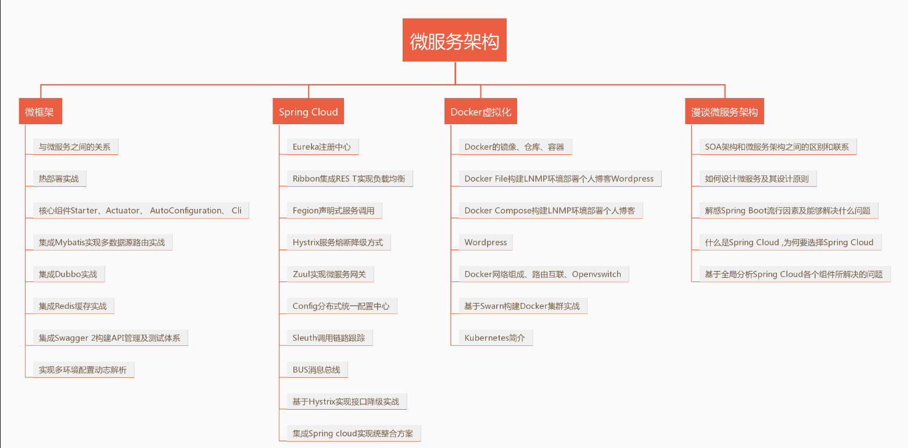
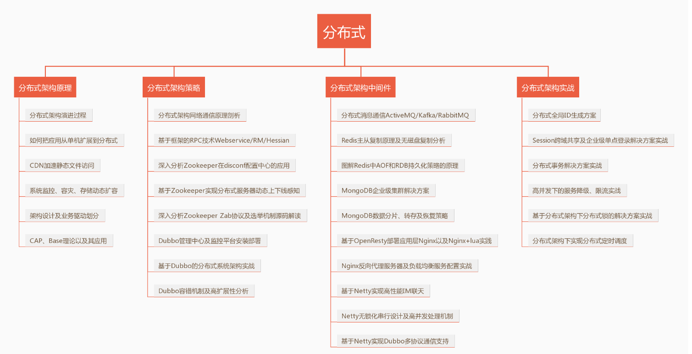
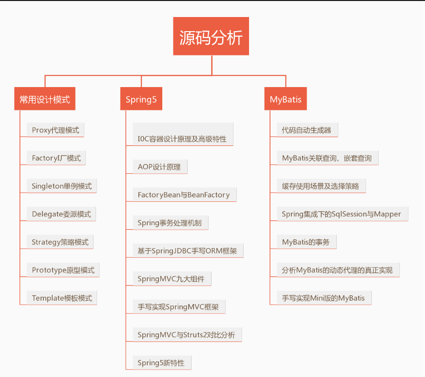
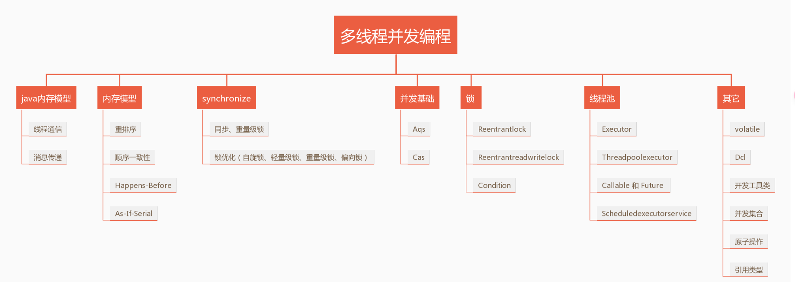
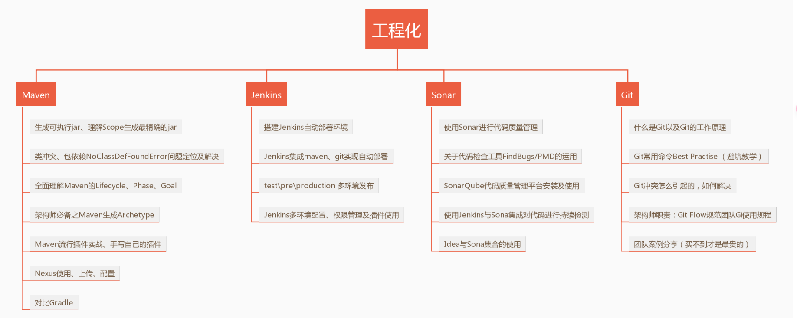
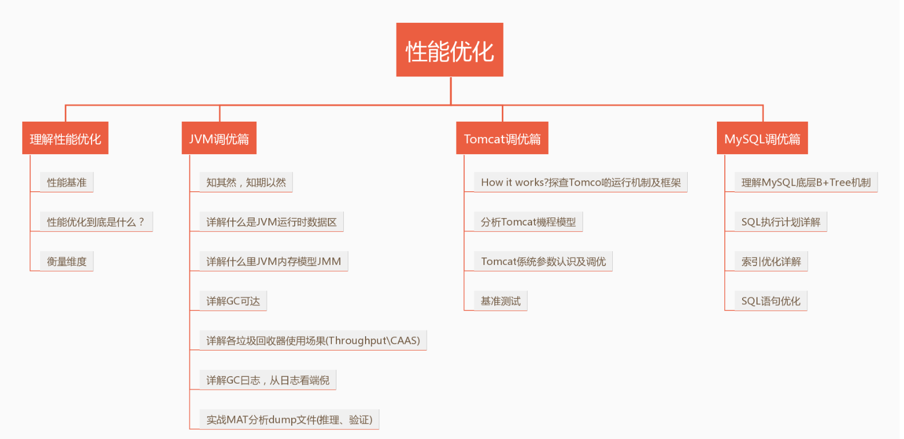
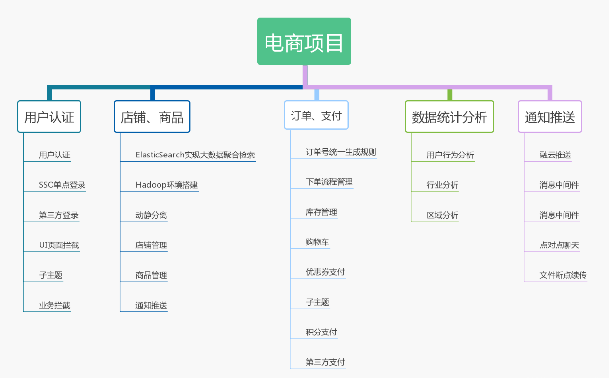

# Java 架构师之路

架构师的内功主要包括三部分：**判断力、执行力、创新力**，简单解释如下：

1. 判断力：能够准确判断系统的复杂度在哪里，就像武侠高手一样，能够准确地看出对手的破绽和弱点。
2. 执行力：能够使用合适的方案去解决复杂度问题，就像武侠高手一样，能选择合适的招式或者方法打败对手。
3. 创新里：能够创造新的解决方案解决复杂度问题，就像武侠世界里，小一些的创新是创新招式，而武学宗师能够创立新的武学或者心法，例如张三丰创立太极拳一样。

因此，要成为一个优秀的架构师，就需要不断提升自己这几方面的内功，而者三方面的能力来源于 **经验、视野、思考**。

1. 经验：设计的系统越多，系统越复杂，架构师的内功也就越强，不管是成功的架构，还是失败的架构，不管是踩坑的经验，还是填坑的经验，都将成为架构师内功的一部分。
2. 视野：掌握的知识和技能越多、越深，架构师的内功也就越强，他山之石可以攻玉，站在巨人的肩膀上会看的更高更远。
3. 思考：经验和视野都是外部输入，类似于我们吃的食物，但光吃还不行，还要消化，将其变为我们自己的营养，这就是思考的作用，思考能将部分经验和视野中的模式、判断、选择、技巧等提炼出来为我们所用，思考也能促使我们产生新的创意和灵感。

结合上面的分析，从程序员到架构师的成长之路，总的指导原则是：积累经验、拓展视野、深度思考。按照这个总的原则为指导，接下来我们看看从程序员到架构师的成长过程中，具体如何实践。

程序员到架构师的技术成长之路分为几个典型的阶段：

```java
  工程师 - 高级工程师 - 技术专家 - 初级架构师 - 中级架构师 - 高级架构师
```

虽然总的指导原则是一样的，但具体的实践方法有很大差别，如果在正确的姐u的那采取了错误的方法，可能会出现事倍功半的问题。


------


# 第一步：工程师


## 1.阶段描述

成为一个合格的工程师需要 1~3 年时间，其典型特征是 ”在别人的指导下完成开发“ ，这里的 ”别人“ 主要是 ”高级工程师“ 或者 ”技术专家“ ，通常情况下，高级工程师或者技术专家负责需求分析和过程讨论、方案设计，工程师则负责编码实现，高级工程师或者技术专家会指导工程师进行编码实现。


## 2.成长指导

工程师阶段是最原始的 **基础技能积累阶段** ，主要积累基础知识，包括编程语言、编程工具、各类系统的基本使用。以 Java 后端工程师为例，工程师阶段需要积累的经验和技能有：

- Java 的语法、基本数据结构的使用。
- Eclipse、IDEA、Maven、Linux 命令行等各种工具。
- 数据库 CRUD 操作、缓存的基本使用等。
- 业务系统的基本流程。

工程师阶段最好的学习方法就是，找经典的书籍系统地学习，而不是遇到一个问题到网上搜搜然后就解决了事。以 Java 为例，《Java 编程思想》《Java 核心技术》《TCP/IP 协议》这类大部头，一定要完整地看一遍，即使里面很多内容当前工作暂时用不上。


------


# 第二步：高级工程师


## 1.阶段描述

成为高级工程师需要 2~5 年，其典型特征是 **独立完成开发** ，包括需求分析、方案设计、编码实现，其中需求分析和方案设计已经包含了 **判断** 和 **选择**，只是范围相对于来说小一些，更多是在已有架构下进行设计。以 Java 后端工程师为例，高级工程师需要完成的工作包括：

- MySQL 数据库表如何设计，是设计成两个表还是三个表？
- 是否要使用缓存，缓存的 Key 和 Value 如何设计，缓存的更新策略是什么？
- 产品提出的需求是否合理？是否有更好的方式来满足？


## 2.成长指导

从普通工程师成长为高级工程师，主要需要 **积累方案设计经验** ，简单来说就是业务当前用到德相关技术德设计经验。以 Java 后端工程师为例，包括：表设计经验、缓存设计经验、业务流程设计经验、接口设计经验等。当接到一个业务需求德时候，高级工程师柠檬狗组合这些设计经验，最终完成业务需求。

高级工程师阶段相比于工程师阶段，有两个典型的差异：

- 深度：如果说工程师是要求知道 How ，那高级工程师就要求知道 Why 了。例如 Java 的各种数据结构的实现原理，因为只有深入掌握了这些实现原理，才能对其优缺点和使用场景有深刻理解，这样在做具体方案设计的时候才能够选择合适的数据结构。
- 理论：理论就是前人总结出来的成熟的设计经验，例如数据库设计的  3 个范式、面向对象的设计模式、SOLID 设计原则、缓存设计理论 (缓存穿透、缓存雪崩、缓存热点) 等。

针对技术深度，建议去进行系统地学习，包括看书和研究源码。例如研究 Java 虚拟机可以看《深入理解 Java 虚拟机》、研究 MySQL 可以看《MySQL 技术内幕：InnoDB 存储引擎》、研究 Memcache 可以去看其源码。

针对设计理论，由于涉及的点很多，没有一本书能够涵盖这么多的设计点，因此更多的是依靠自己去网上搜索资料学习、那么我们怎么知道哪些地方有设计理论呢？简单来说，就是假设每个环节都有设计理论，然后带着这种假设去搜索验证看看是否真的有很成熟的设计理念。


------


# 第三步：技术专家


## 1.阶段描述

成长为技术专家需要 4~8  年时间，其典型的特征是 ”某个领域的专家“ ，通俗地讲，只要是这个领域的问题，技术专家都可以解决。例如 Java 开发专家、PHP 开发专家、Android 开发专家、iOS 开发专家、前端开发专家等等。通常情况下，”领域“ 的范围不能太小，例如我们可以说 ”Java 开发专家“，但不会说 ”Java 多线程专家“ 或 ”Java JDBC 专家“ 。

技术专家与高级工程师的一个典型区别就是，高级工程师主要是在已有的架构框架下完成设计，而技术专家会根据需要修改、扩展、优化架构。例如，同样是 Java 开发，高级工程师关注的是如何优化 MySQL 的查询性能，而技术专家就会考虑引入 Elasticsearch 来完成搜索。


## 2.成长指导

从高级工程师成长为技术专家，主要需要 **拓展技术宽度** ，因为一个 **领域** 必然会涉及众多的技术面。以 Java 后端开发为例，要成为一个 Java 开发专家，需要掌握 Java 多线程、JDBC 、Java 虚拟机、面向对象、设计模式、Netty、Elasrucsearch、Memcache、Redis、MySQL 等众多技术。常见的拓展技术宽度的方法有：

- 学习业界成熟的开源方案，例如，Java 开发可以去学习 Redis、Memcache、Netty 等，Android 开发可以去研究 Retrofit、Fresco、OkHttp 等。
- 研究业界的经验分享，例如 BAT、FANG 等大公司的经验，可以通过参加技术大会等方式去近距离了解。

需要注意的是，拓展技术宽度并不意味着仅仅只是知道一个技术名词，而是要深入去理解每个技术的原理、优缺点、应用场景，否则就会成为传说中的“PPT 技术专家”。例如，以 Java 开发为例，知道 Netty 是个高性能网络库是远远不够的，还需要学习 Netty 的原理，以及具体如何使用 Netty 来开发高性能系统。


------


# 第四步：初级架构师


## 1.阶段描述

成长为初级架构师需要 5~10 年，其典型特征就是能够 **独立完成一个系统的设计** ，可以是从 0 到 1 设计一个新系统，也可以是将架构从 1.0 重构到 2.0 。初级架构师负责的系统复杂度相对来说不高，例如后台管理系统、某个业务下的子系统、100 万 PV 量级的网站等。

初级架构师和技术专家的典型区别是：架构师是基于完善的架构设计方法论的指导来进行架构设计，而技术专家更多的是基于经验进行架构设计。简单来说，即使是同样一个方案，初级架构师能够清晰地阐述架构设计的理由和原因，而技术专家可能就是因为自己曾经这样做过，或者看别人这样做过而选择设计方案。

但在实践工作中，技术专家和初级架构师的区别并不是很明显，事实上很多技术专家其实就承担了初级架构师的角色，因为在系统复杂度相对不高的情况下，架构设计的难度不高，用不同的备选方案最终都能够较好的完成系统设计。例如，设计一个日 PV 100 万的网站，MySQL + Memcache + Spring Boot 可以很好地完成，MongoDB + Redis + Nginx + php-fpm 也可以很好地完成，备选方案设计和选择并不太难，更多的是看团队熟悉哪个技术。


## 2.成长指导

从技术专家成长为初级架构师，最主要的是形成自己的 **架构设计方法论** ，架构设计专栏其实就是为了讲述完整的架构设计方法论，包括架构设计目的、架构设计原则、架构设计步骤、架构设计模式等，类似的架构设计方法论还有 《恰如其分的软件架构：风险驱动的设计方法》和《领域驱动设计》等。

要形成自己的架构设计方法论，主要手段有：

- 系统学习架构设计方法论，包括订阅专栏或者阅读书籍等。
- 深入研究成熟开源系统的架构设计，这个手段在技术专家阶段也会用到，但关注点不一样，同样是研究开源系统，技术专家阶段聚焦于如何更好地应用开源项目；初级架构师阶段聚焦于学习其架构设计原理和理想，例如 Kafaka 的文档中就有关于消息队列架构设计的分析和取舍。
- 结合架构设计方法论，分析和总结自己团队甚至是公司的各种系统的架构设计优缺点，尝试思考架构重构方案。如果在这个基础上真的能够推动架构重构，那就更好了，既能够实践自己的架构设计方法论，同时积累经验，有能够展现自己的技术实力，拿到结果。


------


# 第五步：中级架构师


## 1.阶段描述

成长为中级架构师需要 8 年以上时间，其典型特征是 **能够完成复杂系统的架构设计** ，包含高性能、高可用、可扩展、海量存储等复杂系统，例如设计一个和 kafaka 性能匹敌的消息队列系统，将业务改造为异地多活，设计一个总共 100 人参与开发的业务系统等，

中级架构师与初级架构师的典型区别在于系统的复杂度不同，中级架构师面对的系统复杂度要高于初级架构师。以开源项目为例，初级架构师可能引入某个开源项目就可以完成架构设计，而中级架构师可能发现其实没有哪个开源项目是合适的，而需要自己开发一个全新的项目，事实上很多开源项目就是这样诞生出来的，


## 2.成长指导

从初级架构师成长为中级架构师，最关键的是 **技术深度和技术理论的积累** ，例如：

- 技术理论：CAP 、BASE 是异地多活的设计理论基础，Paxos 是分布式一致性的基础算法、2PC、3PC是分布式事务的基础算法等。
- 技术深度：Kafaka 用磁盘存储还能够做到高效是因为磁盘顺序写；Disruptor 高性能是结合 CPU 预读取机制、缓存行、无锁设计等基础技术；Storm 的高效异或确认机制；Flink 的分布式快照算法等。

疑问：

这些技术理论和技术深度的事情不应该是高级工程师阶段或者技术专家阶段就应该积累的么？为何到了中级架构师阶段反而是成长的关键呢？

主要原因在于高级工程师或者技术专家阶段即使去学习这些技术，实际上也比较难理解透彻，更加难以有机会去应用，更多的时候只是为了这个技术点而已；而到了中级架构师阶段，面对高度复杂的系统，很多时候就是几个关键技术细节决定整个架构设计的成败，或者某个设计方案理论上就是不可行的，如果不深刻理解理论和相关的关键技术点，很难设计优秀的架构。


------


# 第六步：高级架构师


## 1.阶段描述

成长为高级架构师需要 10 年以上的时间，其典型特征是 **创造新的架构模式** ，例如：

- 谷歌大数据论文，创造了分布式存储架构、分布式计算 MapReduce 架构、列式存储架构，开创了大数据时代。
- 在有 MapReduce 分布式u计算架构背景下，Storm 有创造了流式计算架构。
- 在虚拟机很成熟的背景下，Docker 创造了容器化的技术潮流。

高级架构师与中级架构师相比，典型区别在于 **创造性** ，高级架构师能够创造新的架构模式，开创新的技术潮流。


## 2.成长指导

参考技术界：

- 足够复杂的业务场景：例如谷歌的大数据、阿里的双十一、Facebook 的海量用户等，业务场景越复杂，给技术带来的挑战更大，更有可能产生创造性的技术突破。
- 足够强大的技术团队：绝大部分创造性的架构都来源于公司，或者知名的研究机构；灭有技术实力支撑，想突破也是心有余而力不足。
- 不满足于现状的态度：例如虚拟机很成熟但是资源占用太多，所以发明 Docker；MapReduce 难以做到实时运算，所以创造 Storm 流式运算。
- 尊重技术价值的文化：创造性的东西往往需要投入大量的人力和时间，而且刚开始一般都不会很成熟，如果完全结果导向、KPI 导向，创新技术很可能在萌芽阶段就被否定。


------


# 学习线路图


## （一）微服务




## （二）分布式




## （三）源码分析




## （四）多线程并发




## （五）工程化




## （六）性能优化




## （七）电商项目


